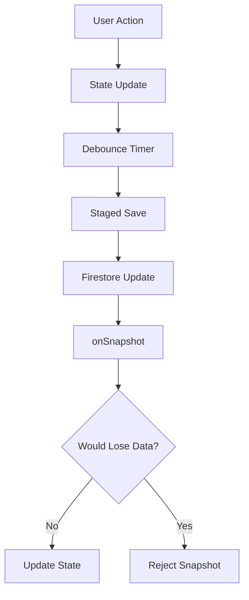

# Documentation Guide for AI Assistants

This document outlines recommended documentation to help AI assistants understand and work effectively with this project.

## Essential Documentation (Already Created)

✅ **MASTER-CONTEXT.md** - Comprehensive project overview, architecture, features, and recent developments
  - Links to: CODE-STRUCTURE.md, STATE-MANAGEMENT.md, PATTERNS.md, GOTCHAS.md, DATA-FLOW.md

✅ **CODE-STRUCTURE.md** - Detailed code organization and structure
  - Links to: MASTER-CONTEXT.md, STATE-MANAGEMENT.md, PATTERNS.md, DATA-FLOW.md, GOTCHAS.md

✅ **STATE-MANAGEMENT.md** - Complete state variable reference
  - Links to: MASTER-CONTEXT.md, CODE-STRUCTURE.md, PATTERNS.md, DATA-FLOW.md, GOTCHAS.md

✅ **PATTERNS.md** - Recurring code patterns and idioms
  - Links to: MASTER-CONTEXT.md, CODE-STRUCTURE.md, DATA-FLOW.md, GOTCHAS.md, STATE-MANAGEMENT.md

✅ **GOTCHAS.md** - Common pitfalls and edge cases
  - Links to: PATTERNS.md, DATA-FLOW.md, STATE-MANAGEMENT.md, CODE-STRUCTURE.md, MASTER-CONTEXT.md

✅ **DATA-FLOW.md** - How data flows through the system
  - Links to: MASTER-CONTEXT.md, CODE-STRUCTURE.md, PATTERNS.md, STATE-MANAGEMENT.md, GOTCHAS.md

## Recommended Additional Documentation

### 1. **Code Structure & Organization**

**File: `CODE-STRUCTURE.md`**
- Component hierarchy (even though it's mostly one file, document the logical sections)
- Function organization within `page.jsx`
- Key function groups (data fetching, playback control, UI handlers, etc.)
- Import organization
- State management patterns
- Ref usage patterns

**Example Structure:**
```markdown
## page.jsx Organization

### Imports (Lines 1-100)
- React hooks
- Firebase imports
- YouTube API
- Icons
- Utilities

### State Management (Lines 200-400)
- useState hooks grouped by concern
- useRef hooks for session data
- State initialization patterns

### Core Functions (Lines 500-1500)
- Data fetching functions
- Playback control functions
- Navigation functions

### UI Rendering (Lines 4000-6000)
- Main component JSX
- Side menu screens
- Modals
- Context menus
```

### 2. **Data Flow Diagrams**

**File: `DATA-FLOW.md`**
- How data flows from Firestore → React state → UI
- How user actions trigger state changes → saves
- Snapshot listener flow
- Save debouncing flow
- Title fetching flow
- Bulk operations flow

**Use ASCII diagrams or Mermaid syntax:**


### 3. **Decision Log**

**File: `DECISIONS.md`**
- Document WHY technical decisions were made
- Trade-offs considered
- Alternatives rejected
- Future considerations

**Example:**
```markdown
## 2025-01-06: Store Only Video IDs in Main Document

**Problem:** Firestore document exceeded 1MB limit

**Decision:** Store only video IDs (strings) in main document, fetch titles on load

**Rationale:**
- Reduces document size by ~80%
- Titles can be fetched asynchronously
- Better scalability for large playlists

**Trade-offs:**
- Increased API usage on first load
- Slight delay in title display
- More complex loading logic

**Alternatives Considered:**
- Pagination (too complex)
- Separate documents per playlist (too many reads)
- Compression (minimal gains)

**Future:** Consider lazy loading titles only when videos are viewed
```

### 4. **Common Patterns & Idioms**

**File: `PATTERNS.md`**
- Recurring code patterns used throughout the project
- Helper functions and their usage
- State update patterns
- Error handling patterns
- API call patterns

**Example:**
```markdown
## Pattern: Debounced Save

```javascript
// Pattern: Always use debounced saves for Firestore
useEffect(() => {
  if (mainDataSaveTimer.current) clearTimeout(mainDataSaveTimer.current);
  mainDataSaveTimer.current = setTimeout(() => {
    performStagedSave();
  }, 2000);
}, [playlists, playlistTabs]);
```

## Pattern: Session-Specific Data in Refs

```javascript
// Pattern: Use refs for data that shouldn't persist
const shuffleOrders = useRef({});
// Never save to Firestore, reset each session
```

## Pattern: Data Loss Prevention

```javascript
// Pattern: Always check wouldLoseData before accepting snapshots
if (wouldLoseData) {
  console.log('⚠️ Would lose data, rejecting snapshot');
  return;
}
```
```

### 5. **State Management Guide**

**File: `STATE-MANAGEMENT.md`**
- Complete state variable reference
- When to use useState vs useRef
- State update patterns
- State dependencies and effects
- Common state bugs and how to avoid them

**Example:**
```markdown
## State Variables Reference

### Playback State
- `currentPlaylistIndex`: Index in playlists array
- `currentVideoIndex`: Index in current playlist's videos array
- `activeShuffleOrder`: Current playback order (array of indices)
- `currentShufflePosition`: Position in shuffle order

### UI State
- `showSideMenu`: Which side menu is open ('playlists' | 'videos' | 'history' | 'search' | 'author' | null)
- `videoFilter`: Current filter in video grid ('all' | 'unsorted' | 'red' | 'green' | 'pink' | 'yellow')

### Session State (useRef - Not Saved)
- `playlistShuffleOrders`: Shuffle orders per playlist per filter
- `titlesFetchedThisSession`: Track fetched titles to prevent duplicate API calls
```

### 6. **API Integration Guide**

**File: `API-INTEGRATION.md`**
- YouTube Data API v3 usage
- Rate limits and quota management
- Caching strategies
- Error handling
- API call patterns

**Example:**
```markdown
## YouTube Data API v3

### Endpoints Used
- `/v3/playlistItems` - Fetch playlist videos
- `/v3/videos` - Get video details (titles, durations, metadata)
- `/v3/search` - Search for videos
- `/v3/channels` - Get channel uploads playlist

### Rate Limits
- Daily quota: 10,000 units
- Per-100-seconds: 1,000 units
- Batch size: 50 videos per request

### Caching Strategy
1. Check videoMetadata subcollection first
2. Only fetch uncached videos
3. Save fetched data to cache
4. Session-level tracking prevents duplicate calls
```

### 7. **Firebase Patterns**

**File: `FIREBASE-PATTERNS.md`**
- Firestore structure
- Query patterns
- Update patterns
- Snapshot handling
- Batch operations
- Subcollection usage

**Example:**
```markdown
## Firestore Structure

```
/users/{userId}/
  ├── playlists: array (main document)
  ├── playlistTabs: array (main document)
  ├── videoProgress: object (main document, debounced)
  └── videoMetadata/{videoId}/ (subcollection)
      ├── duration
      ├── title
      ├── author
      └── ...
```

## Query Patterns

### Get User Document
```javascript
const userDocRef = doc(db, 'users', userId);
onSnapshot(userDocRef, (snapshot) => { ... });
```

### Query Subcollection
```javascript
const metadataRef = collection(db, 'users', userId, 'videoMetadata');
const q = query(metadataRef, where('__name__', 'in', batchIds));
```

## Update Patterns

### Staged Save (Debounced)
- Accumulate changes
- Single updateDoc call
- Prevents excessive writes

### Batch Operations
- Use writeBatch for multiple updates
- Max 500 operations per batch
- Split into chunks of 400 for safety
```

### 8. **Common Tasks & Recipes**

**File: `TASKS.md`**
- Step-by-step guides for common operations
- How to add a new feature
- How to debug common issues
- How to optimize performance
- How to add a new UI element

**Example:**
```markdown
## How to Add a New Side Menu Screen

1. Add state: `const [showSideMenu, setShowSideMenu] = useState(null);`
2. Add button in top menu controls
3. Add screen JSX in side menu section
4. Add navigation handlers
5. Update showSideMenu checks

## How to Add a New Bulk Operation

1. Add state variables for mode and selections
2. Add toggle button in appropriate UI
3. Add selection UI (checkboxes, highlights)
4. Implement handler function
5. Add confirmation/execute button
6. Update state after operation
```

### 9. **Glossary & Terminology**

**File: `GLOSSARY.md`**
- Project-specific terms
- Abbreviations
- Naming conventions
- Domain concepts

**Example:**
```markdown
## Terms

**Colored Folder:** A virtual group within a playlist (red, green, pink, yellow) for organizing videos

**Virtual Playlist:** A playlist-like view created from a colored folder (ID format: "playlistId_color")

**Unsorted Playlist:** Special playlist (_unsorted_) for videos from search/author lookup

**Staged Save:** Accumulated changes saved in a single Firestore update (debounced)

**Session-Specific:** Data that resets each session (stored in useRef, not Firestore)

**Chronological Filter:** The active filter in the main player (all, red, green, pink, yellow)

**Video Filter:** The active filter in the side menu video grid (all, unsorted, red, green, pink, yellow)
```

### 10. **Known Issues & Gotchas**

**File: `GOTCHAS.md`**
- Common pitfalls
- Things that break easily
- Edge cases to watch for
- Browser compatibility issues
- Performance considerations

**Example:**
```markdown
## Gotchas

### Firestore Document Size
- Main document must stay under 1MB
- Video IDs only (no titles/objects)
- Use subcollections for detailed data

### Snapshot Race Conditions
- Always check `isSavingRef` before processing snapshots
- Use `wouldLoseData` check to prevent overwrites
- Preserve locally added playlists not yet in snapshot

### API Rate Limits
- Batch API calls (50 videos per request)
- Check cache before making API calls
- Track fetched items in session to prevent duplicates

### State Updates
- Use functional updates: `setState(prev => ...)`
- Be careful with dependencies in useEffect
- Don't update state during render
```

### 11. **Component Interaction Map**

**File: `COMPONENT-INTERACTIONS.md`**
- What components/functions interact
- Data flow between components
- Event propagation
- State sharing patterns

### 12. **Performance Considerations**

**File: `PERFORMANCE.md`**
- What's optimized and why
- Performance bottlenecks
- Optimization strategies used
- Future optimization opportunities

**Example:**
```markdown
## Optimizations

### Debouncing
- Saves debounced to 2 seconds
- Video progress debounced to 2 seconds
- Prevents excessive Firestore writes

### Caching
- Video metadata cached in Firestore subcollection
- Session-level title fetching cache
- localStorage for video progress

### Batching
- API calls batched (50 videos per request)
- Firestore updates batched (400 operations per batch)
- Title fetching batched with delays

### Lazy Loading
- Titles fetched in background
- Videos loaded incrementally (12 at a time)
- History loaded incrementally
```

### 13. **Testing Scenarios**

**File: `TESTING-SCENARIOS.md`**
- Manual test cases
- Edge cases to test
- Regression test scenarios
- User flows to verify

**Example:**
```markdown
## Test Scenarios

### Playback Flow
1. Load site → Should resume from last watched video
2. Click next video → Should advance and save progress
3. Switch playlist → Should remember position
4. Close and reopen → Should resume from same position

### Bulk Operations
1. Bulk add 10 playlists → Should show progress
2. Bulk delete 5 playlists → Should remove all selected
3. Bulk tag 3 playlists → Should assign to colored folders

### Data Persistence
1. Add playlist → Refresh → Should persist
2. Merge playlists → Refresh → Should persist
3. Add colored folder → Refresh → Should persist
```

### 14. **Environment & Setup**

**File: `SETUP.md`**
- Development environment setup
- Required API keys
- Firebase configuration
- Dependencies
- Build process
- Deployment

### 15. **Visual Documentation**

**File: `SCREENSHOTS/` (Directory)**
- Screenshots of all major screens
- UI states (modals, menus, etc.)
- Before/after comparisons
- Annotated screenshots showing features

**Naming Convention:**
- `playlists-screen.png`
- `video-grid-red-folder.png`
- `bulk-delete-mode.png`
- `history-screen.png`
- `search-results.png`

### 16. **User Flows**

**File: `USER-FLOWS.md`**
- Step-by-step user journeys
- Common workflows
- Feature usage flows

**Example:**
```markdown
## User Flow: Adding and Organizing Videos

1. User clicks "Add Playlist" button
2. Enters playlist ID
3. Playlist appears in grid
4. User clicks playlist thumbnail
5. Video grid opens showing all videos
6. User hovers over video
7. 4x4 color grid appears
8. User clicks red color
9. Video moves to red colored folder
10. User clicks filter button (Play icon)
11. Cycles to red folder
12. Only red folder videos play
```

### 17. **Code Examples Library**

**File: `EXAMPLES.md`**
- Common code snippets
- Reusable patterns
- Helper functions
- Utility code

### 18. **Change Log**

**File: `CHANGELOG.md`**
- Major changes over time
- Feature additions
- Bug fixes
- Performance improvements
- Breaking changes

### 19. **Future Roadmap**

**File: `ROADMAP.md`**
- Planned features
- Technical debt to address
- Optimization opportunities
- Known limitations

### 20. **AI Assistant Quick Start**

**File: `AI-QUICK-START.md`**
- Quick reference for AI assistants
- Most important files to read first
- Common tasks and how to approach them
- Key concepts to understand

**Example:**
```markdown
# AI Assistant Quick Start

## First Steps
1. Read MASTER-CONTEXT.md (this gives you the big picture)
2. Read CODE-STRUCTURE.md (understand the code organization)
3. Read STATE-MANAGEMENT.md (understand state patterns)

## Key Concepts
- Single-file component (page.jsx) with ~6000 lines
- Firebase Firestore for persistence
- Session-specific data in useRef (not saved)
- Debounced saves to prevent excessive writes
- Document size optimization (only IDs in main document)

## Common Tasks
- Adding UI: Look at similar existing UI patterns
- Adding state: Follow existing useState/useRef patterns
- Adding API calls: Check API-INTEGRATION.md for patterns
- Debugging: Check GOTCHAS.md for common issues

## Important Files
- `app/page.jsx` - Main application (everything is here)
- `MASTER-CONTEXT.md` - Project overview
- `PATTERNS.md` - Code patterns to follow
```

## Documentation Priority

### ✅ High Priority (COMPLETED)
1. ✅ MASTER-CONTEXT.md - Comprehensive project overview
2. ✅ CODE-STRUCTURE.md - Code organization and structure
3. ✅ STATE-MANAGEMENT.md - Complete state reference
4. ✅ PATTERNS.md - Code patterns and idioms
5. ✅ GOTCHAS.md - Common pitfalls
6. ✅ DATA-FLOW.md - Data flow diagrams
7. ✅ DOCUMENTATION-MAINTENANCE.md - Maintenance strategy
8. ✅ AI-QUICK-START.md - Quick start guide
9. ✅ DOCUMENTATION-GAPS.md - Gap analysis

### 🔴 High Priority (MISSING - Recommended)
10. **SCREENSHOTS/** - Visual UI reference (highly recommended for handover)

### 🟡 Medium Priority (Optional)
11. API-INTEGRATION.md - Complete API reference
12. FIREBASE-PATTERNS.md - Complete Firestore patterns
13. SETUP.md - Environment setup guide
14. TESTING-SCENARIOS.md - Test cases
15. USER-FLOWS.md - User journey documentation

### 🟢 Low Priority (Nice to Have)
16. GLOSSARY.md - Terminology reference
17. Component interactions map
18. Performance deep dive
19. Roadmap
20. Decision log

## Documentation Format Recommendations

### For AI Assistants
- **Markdown format** (easy to parse)
- **Clear headings** (hierarchical structure)
- **Code examples** (show, don't just tell)
- **ASCII diagrams** (or Mermaid for complex flows)
- **Cross-references** (link related docs)
- **Examples** (concrete use cases)

### For Screenshots
- **Annotated screenshots** (arrows, labels, highlights)
- **State variations** (show different UI states)
- **Before/after** (for changes)
- **Organized by feature** (folder structure)

### For Code Examples
- **Complete examples** (not just snippets)
- **Context** (where it's used, why)
- **Variations** (different ways to do the same thing)
- **Anti-patterns** (what NOT to do)

## Maintenance

> **See [DOCUMENTATION-MAINTENANCE.md](./DOCUMENTATION-MAINTENANCE.md) for complete maintenance strategy**

- **Update docs when code changes** (keep in sync)
- **Version control docs** (commit with code changes)
- **Review periodically** (ensure accuracy)
- **Add examples** (as you discover patterns)
- **Document decisions** (why, not just what)

## Handover Readiness

**Current Status:** ✅ **Ready for Handover**

**Documentation Completeness:**
- ✅ All high-priority documentation complete
- ✅ Cross-references throughout
- ✅ AI-friendly formatting
- ✅ Maintenance strategy defined
- ⚠️ Screenshots recommended (see DOCUMENTATION-GAPS.md)

**See [DOCUMENTATION-GAPS.md](./DOCUMENTATION-GAPS.md) for gap analysis and recommendations.**

## Tools for Documentation

- **Markdown editors** (VS Code, Obsidian, etc.)
- **Diagram tools** (Mermaid, Draw.io, Excalidraw)
- **Screenshot tools** (with annotation)
- **Code formatters** (for consistent examples)
- **Link checkers** (ensure cross-references work)

---

**Remember:** Good documentation is like good code - it should be clear, concise, and helpful. Focus on what would help someone (or an AI) understand and work with the codebase effectively.
